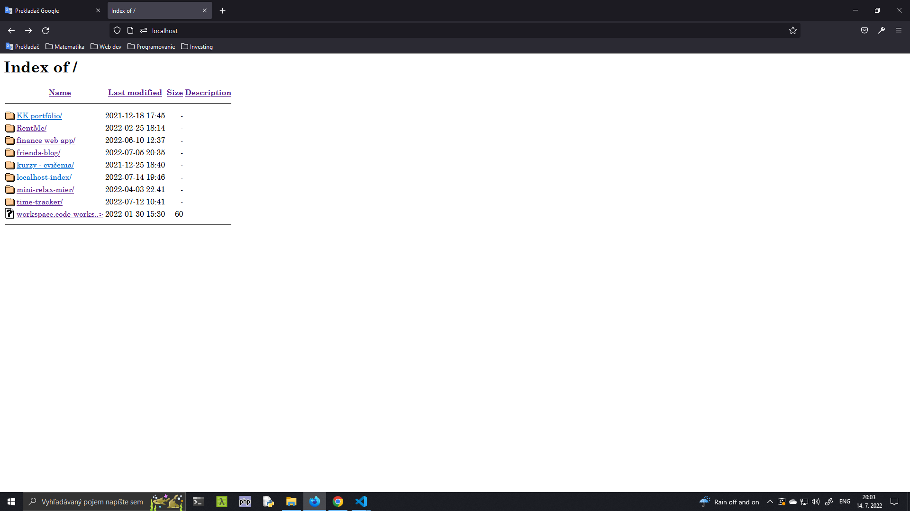

# **localhost-index**
Single-file project. Designing custom XAMPP/Laragon/etc. ```index.php``` page to use for local development.

# Description
For local development, there are various web server stacks such as: XAMPP, MAMP, WampServer, Laragon, etc.<br>
Web server _Apache / Nginx_ on each of them tries to laod an ```index.php / index.html```. If these files are not present,<br>
**"index"** of installed server is loaded. (see [Visuals](#Visuals))<br><br>
Icons used: [vscode-icons](https://github.com/vscode-icons/vscode-icons)

# Visuals

## Default localhost index without [FancyIndexing:](https://docstore.mik.ua/orelly/linux/apache/ch07_01.htm)


<br>

## Default localhost index with [FancyIndexing:](https://docstore.mik.ua/orelly/linux/apache/ch07_01.htm)


# Setup
Place ```index.php``` file inside your local development folder (such as ```Sites```).<br>

<br>

Next time you open your ```http://localhost/``` there will display custom, formatted folders & files,<br>
as well as brief information about your working directory.