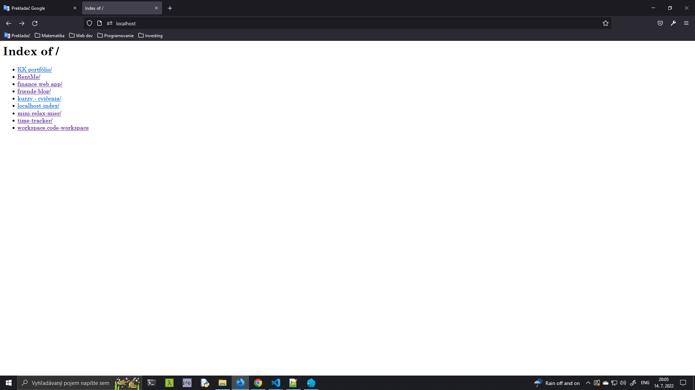
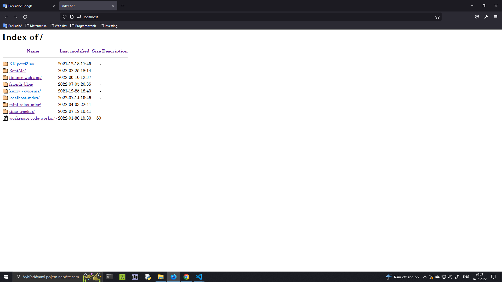
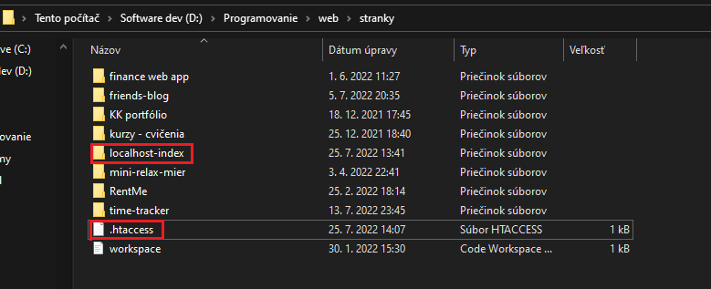

# **localhost-index**
Multi-file project. This project is **continuation** (& secondary branch) of an original single-file project.<br>
It mimics the behaviour of Apache's ```autoindex``` module, which creates index of directory file listings, <br>
but instead of using apache/nginx server generated index page, it uses its own .php control file.
 
# Description
This project could be utilized by web developers developing in local environment (```localhost/```) to beautify default indexing.

## Features
- Eye-compelling minimalist design, good-looking on **mobile devices** too
- Custom icons for all major file extensions (e.g. ```.js, .php, .css, .html```)
- Display of current ```system path``` & ```open in explorer``` button
- Sorting files according to ```file-size```, ```name``` and ```edit date```
- Quote viewer to motivate you

Icons used: [vscode-icons](https://github.com/vscode-icons/vscode-icons)<br>
File explorer ispired by Mac's [Finder](https://en.wikipedia.org/wiki/Finder_(software))

# Visuals

## Default localhost index without [FancyIndexing:](https://docstore.mik.ua/orelly/linux/apache/ch07_01.htm)


<br>

## Default localhost index with [FancyIndexing:](https://docstore.mik.ua/orelly/linux/apache/ch07_01.htm)


# Setup

There are 2 possible approaches, depending on whether you have access to your server's<br>
main ```httpd.conf``` configuration file (or nginx alternative):

### I have access to ```httpd.conf``` *(preferred way)*
1.  Clone or download the files.
2.  Add them to your server's ```DocumentRoot``` (folder from which server displays default file indexes)
3.  Update the server's **main** - ```httpd.conf``` file, this is what the ```DocumentRoot``` section should look like:
```
DocumentRoot "{YOUR_SERVER_ROOT_PATH}"
<Directory "{YOUR_SERVER_ROOT_PATH}">

    Options Indexes FollowSymLinks Includes ExecCGI
    AllowOverride None

    RewriteEngine On
    RewriteCond %{REQUEST_FILENAME} -d
    RewriteRule ^(.*)$ /localhost-index/index.php?path=$1 [L]
    DirectoryIndex localhost-index/index.php

    Require all granted
</Directory>
```

### I don't have access to ```httpd.conf```
1. Clone or download the files.
2. Add them to your server's ```DocumentRoot``` (folder from which server displays default file indexes)
3. Extract ```.htaccess``` file from this project and place it one directory up (directly in the ```DocumentRoot```)
   * **Important!** Be sure to check that your server's ```httpd.conf``` allows ```FollowSymLinks``` option overriding:
     * ```AllowOverride All```, or atleast ```AllowOverride Options=FollowSymLinks```
4. After that, your web dev root directory should look like this:
<br> 

# To-do
- [ ] Test File->get_size() method on ```Windows``` (with ```com_dotnet```) extension enabled
- [ ] Test File->get_size() method on ```Linux```
- [ ] Test File->get_size() method on ```Mac OS```