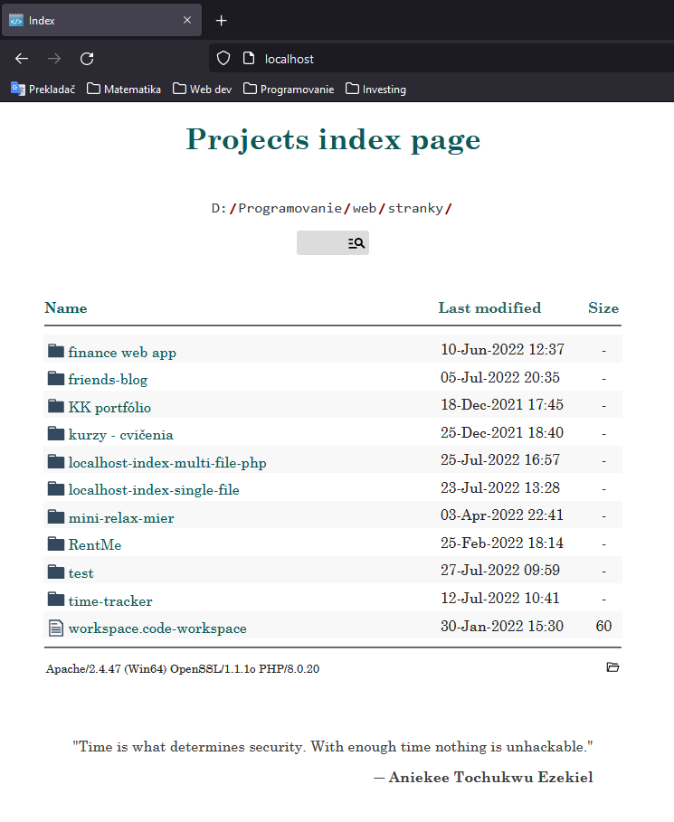

# **Localhost index**
This project is **continuation** of an original single-file project. _(see other branches)_<br>
It takes use of Apache's [mod_autoindex](https://httpd.apache.org/docs/2.4/mod/mod_autoindex.html) module, which creates index of directory file listings, <br>
but instead of using default generated index page, it loads its own custom icons, html & styles.
 
# Description
This project could be utilized by web developers developing in local environment ```'localhost'``` to improve default indexing.

## Features
* Eye-compelling minimalist design, good-looking on **mobile devices** too
* ```Search bar``` for finding files inside your directory
* Custom icons for all major file extensions (e.g. ```.js, .php, .css, .html```)
* Display of current ```system path```
* Handy ```open in explorer``` button
* Sort files according to ```file-size```, ```name``` or ```edit date```
* Random motivational quotes

### Default localhost index


<br>

### **New** [localhost-index](https://github.com/kriskoribsky/localhost-index)


# Setup

### Be sure to check:
* Which **directory** your Apache web server loads, you can do that by checking ```DocumentRoot``` directive,<br>
located inside Apache's main ```httpd.conf``` configuration file.
* **Important!** In order for ```mod_autoindex``` to work, ```FollowSymLinks``` option overriding must be enabled:
  * This is done via the ```AllowOverride All```, or at least ```AllowOverride Options=FollowSymLinks``` option.
  * Example of a ```httpd.conf``` file:
    * ```
      DocumentRoot "D:/Programovanie/web/stranky"
      <Directory "D:/Programovanie/web/stranky">

          Options Indexes FollowSymLinks Includes ExecCGI
          AllowOverride Options=FollowSymLinks

          Require all granted
      </Directory>
      ```
* When making changes to ```httpd.conf``` file, you should restart Apache ```sudo apachectl restart```.

<br>

### After that:

1. Clone or download the files.
2. Add them to your ```DocumentRoot``` directory.
3. Copy the ```.htaccess``` file up one directory.

<br>


### Finally, your ```DocumentRoot``` directory should look like this:


# Customization
Pretty much all the options are located inside ```.htaccess``` file:
* If you want to **hide** some files or directories, there is a ```IndexIngore``` directive.
* You can turn off **file sorting** with ```SuppressColumnSorting``` option in ```IndexOptions``` directive.
* There is also a possibility to remove _default_ ```FoldersFirst``` option to mix files and directories.

You can find more information about these options on [autoindex - indexoptions doc page](https://httpd.apache.org/docs/2.4/mod/mod_autoindex.html#indexoptions)

# Credits & inspiration
* Project inspiration: [Vestride/fancy-index](https://github.com/Vestride/fancy-index)
* Icons: [atom-file-icons](https://github.com/file-icons/atom)<br>
* File explorer design ispired by Mac's [Finder](https://en.wikipedia.org/wiki/Finder_(software))

# Documentation
* [Main documentation source](https://httpd.apache.org/docs/2.4/mod/mod_autoindex.html)
